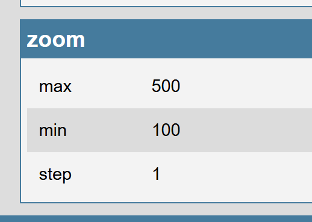

# \&zoom

Sender-Side Option! ([`&push`](../../source-settings/push.md))

## Options

Example: `&quality=0`

| Value                             | Description                                    |
| --------------------------------- | ---------------------------------------------- |
|  (no value given)                 | Will ask for Pan Tilt and Zoom permissions     |
| `Some zoom amount to use on load` | Will zoom in by this amount; depends no device |

## Details

A Logitech Brio has a range of 100 to 500 for its digital zoom, with steps of 1.\
\
It's not possible as a result to get perfectly smooth zooming this way, as its a digital zoom in the Logitech Brio that will step up the zoom immediately, so you may find using \&digitalzoom instead more useful. To increase the quality, use \&digitalzoom in conjunction with \&quality=4k, but the digital zoom offered by VDO.Ninja is smoothed out.\
\
That said, if your device does have an optical zoom, using \&zoom instead makes sense, and may actually provide smooth zooming giving the analog nature of optical zoom.\
\
Just like with using \&ptz, using \&zoom may ask you on joining if you wish to give VDO.Ninja permissions to control your pan, tilt, and zoom. For a Logitech Brio, this permission is needed, but it's not needed for all devices; some smartphones fro example.\
\
Regardless, \&zoom=200 for example can be use to pre-set the zoom to 2X, however the number representing how to much zoom in depends on your browser, device, and camera.\
\
You can visit [https://vdo.ninja/supports](https://vdo.ninja/supports) to see if your camera supports \&zoom, and if so, what range it offers.

<figure><figcaption>
Example URL &#x26;zoom=400 resulting in 4x zoom with a Brio 4K camera
</figcaption></figure>

<figure><figcaption>
As per seen in <a href="https://vdo.ninja/supports">https://vdo.ninja/supports</a>
</figcaption></figure>
